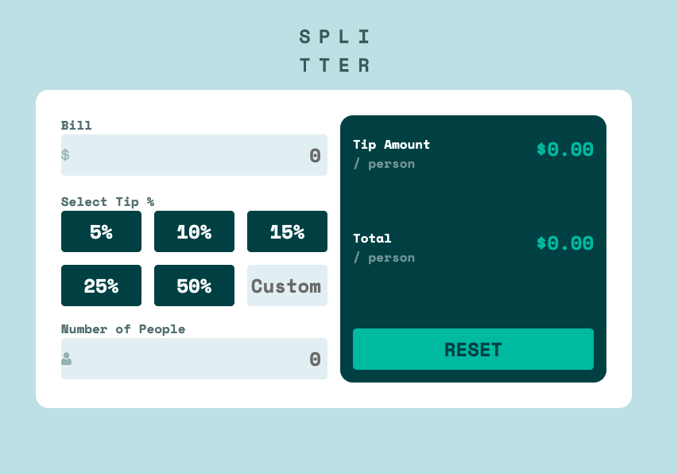

# Frontend Mentor - Tip calculator app solution

Link: https://viviantang92.github.io/tip-calculator-app/

This is a solution to the [Tip calculator app challenge on Frontend Mentor](https://www.frontendmentor.io/challenges/tip-calculator-app-ugJNGbJUX). Frontend Mentor challenges help you improve your coding skills by building realistic projects.

### Screenshot

### Built with

- Semantic HTML5 markup
- Sass
- Flexbox
- CSS Grid
- Mobile-first workflow

## Author

- Frontend Mentor - [@VivianTang11](https://www.frontendmentor.io/profile/VivianTang11)
